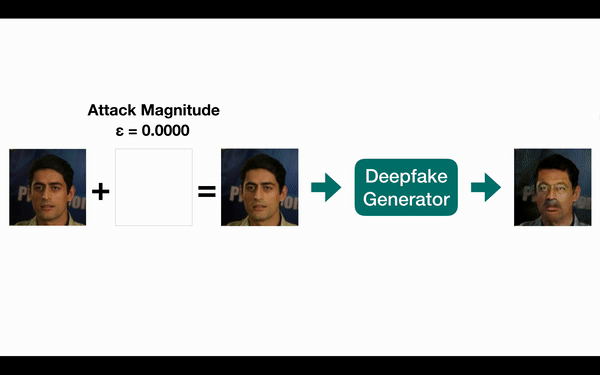
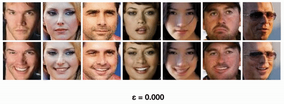

## Disrupting Deepfakes: Adversarial Attacks on Conditional Image Translation Networks
**[[Paper]](https://arxiv.org/abs/2003.01279)**

<p align="center"></p>
<p align="center"></p>

Official PyTorch implementation of **[Disrupting Deepfakes](https://arxiv.org/abs/2003.01279)**. This repository contains code for adversarial attacks (disruptions) for (conditional) image translation networks. The StarGAN, GANimation, pix2pixHD and CycleGAN networks are included - and the attacks can be adapted to any image translation network. We include adaptations of FGSM, I-FGSM and PGD attacks. We also include our class transferable attacks, adversarial training for image translation networks and spread-spectrum evasion of blur defenses.

> **Disrupting Deepfakes: Adversarial Attacks Against Conditional Image Translation Networks and Facial Manipulation Systems**<br>
> [Nataniel Ruiz](https://natanielruiz.github.io), [Sarah Adel Bargal](https://cs-people.bu.edu/sbargal/), [Stan Sclaroff](http://www.cs.bu.edu/~sclaroff/)    <br/>
> Boston University <br/>
> https://arxiv.org/abs/2003.01279 <br>
>
> **Abstract:** *Face modification systems using deep learning have become increasingly powerful and accessible. Given images of a person's face, such systems can generate new images of that same person under different expressions and poses. Some systems can also modify targeted attributes such as hair color or age. This type of manipulated images and video have been coined Deepfakes. In order to prevent a malicious user from generating modified images of a person without their consent we tackle the new problem of generating adversarial attacks against such image translation systems, which disrupt the resulting output image. We call this problem disrupting deepfakes. Most image translation architectures are generative models conditioned on an attribute (e.g. put a smile on this person's face). We are first to propose and successfully apply (1) class transferable adversarial attacks that generalize to different classes, which means that the attacker does not need to have knowledge about the conditioning class, and (2) adversarial training for generative adversarial networks (GANs) as a first step towards robust image translation networks. Finally, in gray-box scenarios, blurring can mount a successful defense against disruption. We present a spread-spectrum adversarial attack, which evades blur defenses.*

## Datasets
TODO: Include download instructions for datasets.

## Attack Testing
Here are bash commands for testing our vanilla attacks on each different architecture.
```
# StarGAN Attack Test
cd stargan
python main.py --mode test --dataset CelebA --image_size 256 --c_dim 5 --selected_attrs Black_Hair Blond_Hair Brown_Hair Male Young --model_save_dir='stargan_celeba_256/models' --result_dir='stargan_celeba_256/results_test' --test_iters 200000 --batch_size 1

# GANimation Attack Test
cd ganimation
python main.py --mode animation

# pix2pixHD Attack Test
cd pix2pixHD
python test.py --name label2city_1024p --netG local --ngf 32 --resize_or_crop none

# CycleGAN Attack Test
python test.py --dataroot datasets/horse2zebra/testA --name horse2zebra_pretrained --model test --no_dropout
```

If you want to change the attack method being used, look into the attack.py scripts in each architecture folder and change the number of iterations, attack magnitude and step size. You can also re-run the class transferring and blur evasion experiments on StarGAN by commenting/uncommenting lines 54-61 in stargan/main.py or modifying the stargan/solver.py script to change the attack type.

In order to change attack types for GANimation you can modify lines 386-470 by commenting out the vanilla attack and uncommenting the attack you want to run. 

## Attack Testing
In order to run G+D adversarial training on StarGAN run:
```
# StarGAN Adversarial Training
python main.py --mode train --dataset CelebA --image_size 256 --c_dim 5 --sample_dir stargan_both/samples --log_dir stargan_both/logs --model_save_dir stargan_both/models --result_dir stargan_both/results --selected_attrs Black_Hair Blond_Hair Brown_Hair Male Young
```
If you wish to run vanilla training or generator adversarial training, comment/uncomment the appropriate lines (l.44-49) in stargan/main.py

## Image Translation Network Implementations
We use code from [StarGAN](https://github.com/yunjey/stargan), [GANimation](https://github.com/vipermu/ganimation), [pix2pixHD](https://github.com/NVIDIA/pix2pixHD), [CycleGAN](https://github.com/junyanz/pytorch-CycleGAN-and-pix2pix) and [advertorch](https://github.com/BorealisAI/advertorch). These are all great repositories and we encourage you to check them out and cite them in your work.

## Citation
If you find this work useful for your research, please cite our [paper](https://arxiv.org/abs/2003.01279):
```
@article{ruiz2020disrupting,
    title={Disrupting Deepfakes: Adversarial Attacks Against Conditional Image Translation Networks and Facial Manipulation Systems},
    author={Nataniel Ruiz and Sarah Adel Bargal and Stan Sclaroff},
    year={2020},
    eprint={2003.01279},
    archivePrefix={arXiv},
    primaryClass={cs.CV}
}
```